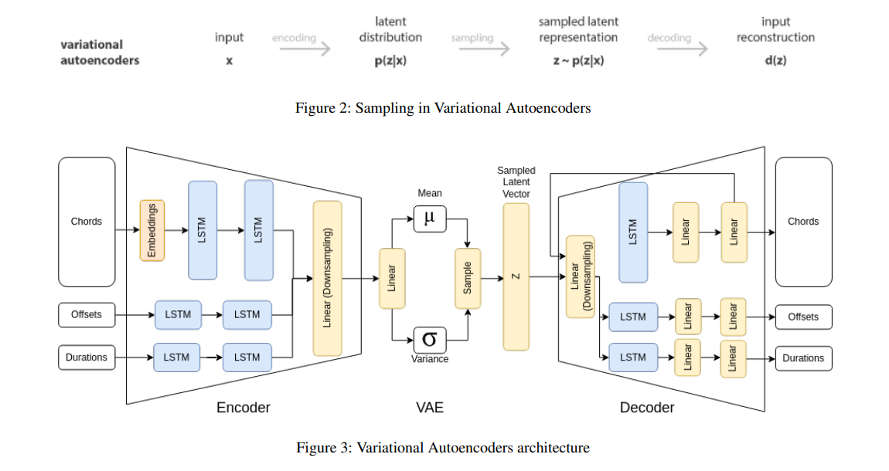

# 8-bit-LoFi-Music-Generator  
 
Using Variational Autoencoders (VAE) and Transformer-XL to generate 8-bit LoFi Music 
 
This project presents the development of an 8-bit LoFi music generator using deep learning techniques, specifically LSTM(short-term memory) and VAE(variational autoencoder)models. By training the model on the LoFi MIDI dataset andfine-tuning it using the NES Music Database (NesMDB), we aim to create a system capable of automatically generating an endless stream of new and rhythmic LoFi music with mel-low jazz-like beats. The VAE model is used to capture the underlying distribution of the LoFi music, while LSTM is employed to generate coherent and melodic sequences. To ensure the fidelity of the generated music, KL divergence is employed as a metric to measure the similarity between the generated and original music samples. The proposed system holds potential for enhancing YouTube live streams, offering a continuous stream of distinctive and soothing LoFi music. 
 
  
Here are the steps of execution: 
1-Implement an encoder and a decoder architecture for the VAE model. 
2-Prepare the input data, which consists of sequences of notes, offsets, and durations extracted from MIDI samples. 
3-Encode the notes using an embedding layer, while the offsets and durations, being float values, do not require embedding. 
4-Pass the embedded notes, offsets, and durations through their respective LSTM layers in the encoder. 
5-Concatenate the outputs of the LSTM layers and downsample the concatenated outputs using two linear layers to obtain the sample latent space. 
6-Generate mean-distributed samples from the latent representation and decode them using the decoder. 
7-In the decoder, use an LSTM cell to extract LSTM hidden cell states from the mean variance latent representation. 
8-Pass the hidden cell states through a linear sequence to generate chord predictions. 
9-Extract chord embeddings from the chord predictions, which will be used by the LSTM cells of offsets and durations. 
10-Pass the chord embeddings through their respective LSTM cells and linear layers to obtain the outputs of offsets and durations. 
11-Train the VAE model for 500 epochs using a batch size of 32 and a chord length of 16. 
12-Calculate losses between the input notes, offsets, and durations, and the generated notes, offsets, and durations during training. 
13-Calculate the Kullback-Leibler (KL) divergence, which measures the similarity between two distributions, to optimize generative results. 
 
14-To generate a new sample: 
a. Generate a random list of floats representing the mean-variance vector. 
b. Extract the latent representation of the sample using the mean-variance vector. 
c. Run the decoder on the latent sample to generate chord embeddings, chord predictions, offset predictions, and duration predictions. 
d. Use the Music21 library to generate MIDI note elements corresponding to the predictions generated by the decoder, configuring each note using the predicted chord, offset, and duration. 
e. Stitch together all the generated elements to create a single MIDI sample file, which can be easily converted to an MP3 file for listening to the generated music. 

